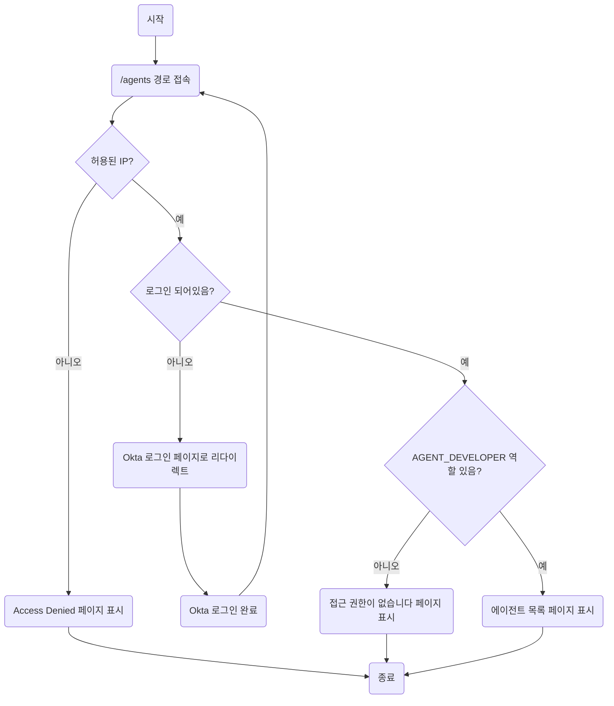

## Prompt

```
[Flowchart]
처음에 /agents 경로로 접속한다. 만약 허용된 ip가 아니라면 Access Denied
페이지가 나온다. 허용된 ip이지만 로그인이 되지 않았다면 okta 로그인 페이지가
나온다. okta 로그인을 하고나면 /agents 페이지로 다시 진입한다. 하지만
로그인정보(userinfo.groups)에 "AGENT_DEVELOPER" role이 없으면, 접근 권한이
없습니다. 페이지가 나온다. role이 있다면, 정상적으로 agent 목록이 있는 화면이
나온다.

```

## Result

